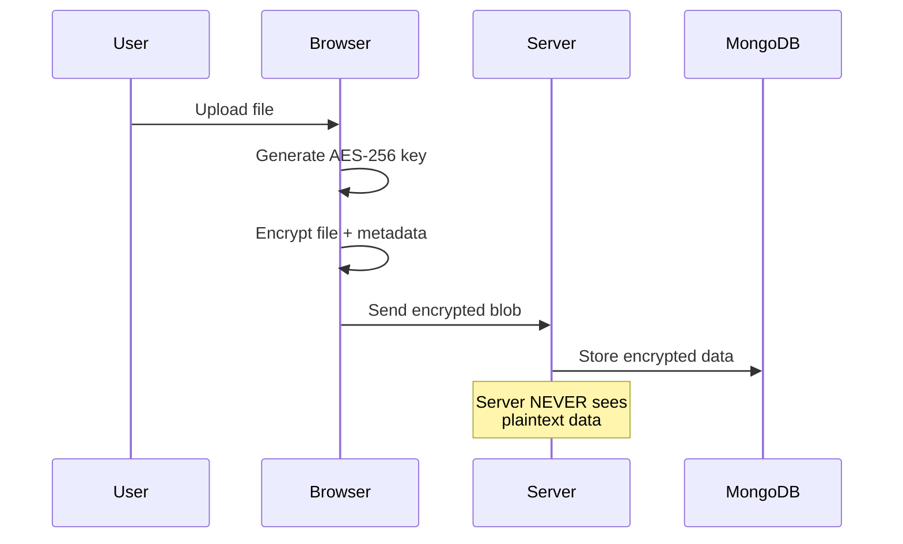

<div align="center">

# 🔐 CryptoSecure Vault

### **Zero-Knowledge Encrypted File Storage**

[](https://crypto-secure-vault.vercel.app)
[](LICENSE)
[](https://react.dev)
[](https://nodejs.org)
[](https://mongodb.com)

<br>


<br><br>

*Your files, your keys, your privacy. The server never sees your data.*

---

</div>

## ✨ What Makes Us Different

<table>
<tr>
<td width="50%">

### 🧠 True Zero-Knowledge
Unlike traditional cloud storage, CryptoSecure Vault encrypts **everything on your device** before upload. The server stores only encrypted blobs—not passwords, not keys, not file names.

</td>
<td width="50%">

### 🔑 Client-Side AES-256-GCM
Military-grade encryption happens in your browser using the Web Crypto API. Your encryption keys never leave your device.

</td>
</tr>
<tr>
<td width="50%">

### 🎭 Panic Mode
Under duress? Enter your panic password to instantly wipe all files and show a clean vault. Your data self-destructs without a trace.

</td>
<td width="50%">

### 🖼️ LSB Steganography Lab
Hide secret messages inside innocent images using our visual steganography tool. Perfect for journalists, activists, and privacy enthusiasts.

</td>
</tr>
</table>

---

## 🚀 Features

<div align="center">

| Feature | Description |
|:---:|---|
| 🔐 | **End-to-End Encryption** — AES-256-GCM client-side encryption |
| 🔒 | **OTP Authentication** — Email-based 2FA for every login |
| 📤 | **Secure File Sharing** — Share encrypted files with permission controls |
| 🎭 | **Panic Mode** — Instant vault wipe with decoy password |
| 🖼️ | **Steganography Lab** — Hide messages in images using LSB encoding |
| 🛡️ | **ZKP Verification** — Cryptographic proof of secure storage |
| 📱 | **Mobile Responsive** — Full-featured on any device |
| 🌙 | **Dark/Light Theme** — Beautiful UI with animated transitions |
| 🌐 | **Multi-Language** — English & Tamil support |

</div>

---

## 🏗️ Architecture

```
┌─────────────────────────────────────────────────────────────────────┐
│                        CryptoSecure Vault                           │
├─────────────────────────────────────────────────────────────────────┤
│                                                                     │
│  ┌─────────────┐         ┌─────────────┐         ┌─────────────┐   │
│  │   Browser   │  HTTPS  │   Vercel    │  HTTPS  │   Render    │   │
│  │   (React)   │◄───────►│  (Frontend) │◄───────►│  (Backend)  │   │
│  └─────────────┘         └─────────────┘         └──────┬──────┘   │
│        │                                                 │          │
│        │ Client-Side                                     │          │
│        │ AES-256-GCM                                     │          │
│        │ Encryption                                      ▼          │
│        │                                         ┌─────────────┐   │
│        │                                         │  MongoDB    │   │
│        │                                         │   Atlas     │   │
│        ▼                                         └─────────────┘   │
│  ┌─────────────┐                                                   │
│  │ Encrypted   │ ──► Only encrypted blobs stored                   │
│  │   Blob      │     Server has ZERO knowledge                     │
│  └─────────────┘                                                   │
│                                                                     │
└─────────────────────────────────────────────────────────────────────┘
```

---

## 🛠️ Tech Stack

<div align="center">

### Frontend


### Backend


### Security


</div>

---

## 🚀 Quick Start

### Prerequisites
- Node.js 18+
- MongoDB Atlas account
- Gmail account (for OTP emails)

### Installation

```bash
# Clone the repository
git clone https://github.com/Vixcy300/CryptoSecure-Vault.git
cd CryptoSecure-Vault

# Install backend dependencies
cd backend
npm install

# Install frontend dependencies
cd ../frontend
npm install
```

### Environment Variables

Create `.env` files:

**Backend (`backend/.env`)**
```env
PORT=5000
MONGO_URI=mongodb+srv://your-connection-string
JWT_SECRET=your-super-secret-jwt-key
EMAIL_USER=your-email@gmail.com
EMAIL_PASS=your-gmail-app-password
```

**Frontend (`frontend/.env`)**
```env
VITE_API_URL=http://localhost:5000/api
```

### Run Locally

```bash
# Terminal 1 - Backend
cd backend
npm run dev

# Terminal 2 - Frontend
cd frontend
npm run dev
```

Visit `http://localhost:5173` 🎉

---

## 📁 Project Structure

```
CryptoSecure-Vault/
├── 📂 frontend/
│   ├── 📂 src/
│   │   ├── 📂 components/     # Reusable UI components
│   │   ├── 📂 pages/          # Page components
│   │   ├── 📂 context/        # React context providers
│   │   ├── 📂 utils/          # Crypto & helper utilities
│   │   └── 📂 modules/        # Encryption & RBAC modules
│   └── 📄 index.html
│
├── 📂 backend/
│   ├── 📂 src/
│   │   ├── 📂 controllers/    # Route handlers
│   │   ├── 📂 models/         # MongoDB schemas
│   │   ├── 📂 routes/         # API routes
│   │   ├── 📂 middleware/     # Auth & validation
│   │   └── 📂 services/       # Email & cleanup services
│   └── 📄 server.js
│
└── 📂 docs/                   # Documentation & assets
```

---

## 🔐 Security Features Deep Dive

### Client-Side Encryption Flow



### Panic Mode Activation

When the panic password is entered:
1. All files are immediately deleted from storage
2. Session is terminated
3. User sees a clean, empty vault
4. No trace of previous data remains

---

## 🤝 Contributing

Contributions are welcome! Please feel free to submit a Pull Request.

1. Fork the repository
2. Create your feature branch (`git checkout -b feature/AmazingFeature`)
3. Commit your changes (`git commit -m 'Add some AmazingFeature'`)
4. Push to the branch (`git push origin feature/AmazingFeature`)
5. Open a Pull Request

---

## 📜 License

This project is licensed under the MIT License - see the [LICENSE](LICENSE) file for details.

---

## 🙏 Acknowledgments

- [Web Crypto API](https://developer.mozilla.org/en-US/docs/Web/API/Web_Crypto_API) for secure browser-based cryptography
- [Framer Motion](https://www.framer.com/motion/) for beautiful animations
- [Lucide Icons](https://lucide.dev/) for the icon set

---

<div align="center">

### 🌟 Star this repo if you find it useful!

<br>

**Built with 💚 by [Vignesh](https://github.com/Vixcy300)**

<br>

[](https://github.com/Vixcy300/CryptoSecure-Vault)
[](https://github.com/Vixcy300/CryptoSecure-Vault/fork)

</div>
